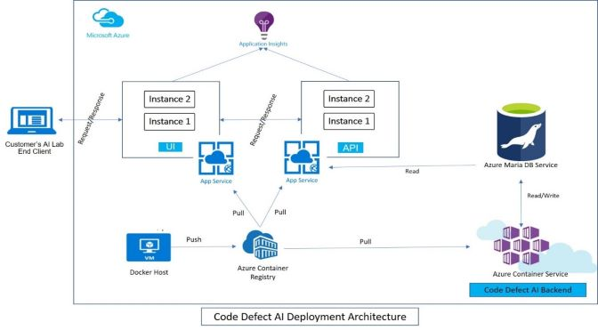

# Code Defect AI (Documentation) -- [Altran](https://www.altran.com)

## Description
Code Defect AI is a machine learning classifier that predicts committed source code files carrying a higher risk of a bug based on historical commits. 


## How it Works
1.	For an open source github project, historical data is collected using RESTFul interfaces and Git CLI. This data includes complete commit history and complete bugs history.
2.	Preprocessing techniques like feature identification, label encoding, one hot encoding, data scaling and normalization are applied to the collected historical commit data.
3.	Labelling is performed on the preprocessed data. The labelling process involves understanding of the pattern in which the fix commits (where a bug has been closed) are tagged for each of the closed issue. After the fix commits are collected, the commits which introduced the bugs are identified by backtracking on historical changes for each file in a fix commit.
4.	If data set contains very small amount of bug data as compared to clean records, synthetic data is also generated to avoid bias towards majority class.
5.	Multiple modelling algorithms are trained on the data prepared.
6.	Once we have a model that has acceptable value of precision and recall, selected model is deployed for prediction on new commits.


## Architecture
For the final deployment of Code Defect AI on Azure infrastructure, following components are used:
-	Virtual machine: To run the code, build and push UI & API code images for deployment.
-	Azure Container registry: To store images for UI,API & Prediction Code.
-	Azure Container Service: Scheduler to predict to new commist and store aggregated results to database.
-	Two Azure Web Apps: webapps for UI & backend API
-	Azure MariaDB Instance: To store prediction data & aggregated results for consumption by UI through RESTful API's
-	Azure Application Insights: To provide traffic analysis for the website.

These elements form the architecture as follows:




## Installation/ Deployment
CodeDefectAI runs on a combination of Azure WebAPP's and Azure Containers. Dockerfiles for all the services are already present in the respective folders.
The summary on how to install and run CodeDefectAI code on Azure Infrastructire, is as follows:
1.	**Database**: Setup Azure MariaDB database service and download certificate for connecting to the same. Update certificate and database details in Django server's [settings.py](cdppro/restservices/api/cdpweb/cdpweb/settings.py) file. 
2.	**UI code**: Open 'ui' folder and build code using ```ng build –prod```. Once you have the dist folder, build an image from docker file in the same folder.
Push the image to Azure container service and create a Azure Webapp.
3.	**Backend Prediction Code**: Open 'training' folder, and build an image from dockerfile present in that folder. Push this image to Azure Container registry, and create a container using Azure Container Service.
4.	**API Code**: Open restservices\api folder and create an image from the dockerfile present. Push the image to Azure container service and create a Azure Webapp.

Please refer to [installation document](documentation/installation/CodeDefectAI_installation_guide_v1.0.docx) for detailed steps on how to setup and run CodeDefectAI platform. 


## License
Licensed under the Apache License, Version 2.0 (the "License"). Please refer to [License](license.txt) for more details.

